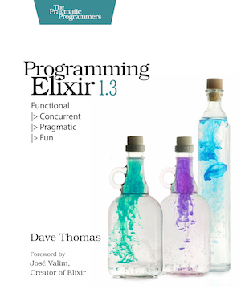

[](https://gitpitch.com/enogrob/ebook-programming-elixir/master)
```
Roberto Nogueira  BSd EE, MSd CE
Solution Integrator Experienced - Certified by Ericsson
```

# Programming Elixir



[Homepage](https://pragprog.com/book/elixir13/programming-elixir-1-3)

## Table of Contents

```
Programming Elixir

Table of Contents

1.Take the red pill
[x] Programming Should Be About Transforming Data
[x] Installing Elixir
[x] Running Elixir
[x] Suggestions for Reading the book
[x] Exercises
[x] Thinking Differently

Part I - Conventional Programming
2. Pattern Matching
[x] Assignment: I Do Not Think It Means What You Think It Means.
[x] More Complex Matches
[x] Ignoring a Value with _ (Underscore)
[x] Variables Bind Once (per Match)
[x] Another Way of Looking at the Equals Sign
3. Immutability
[x] You Already Have (Some) Immutable Data
[x] Immutable Data Is Known Data
[x] Performance Implications of Immutability
[x] Coding with Immutable Data
4. Elixir Basics
[x] Built-in Types
[x] Value Types
[x] System Types
[x] Collection Types
[x] Maps
[x] Binaries
[x] Date and Times
[x] Names, Source Files, Conventions, Operators, and So On
[x] Variable Scope
[x] End of the Basics
5. Anonymous Functions
[x] Functions and Pattern Matching
[x] One Function, Multiple Bodies
[x] Functions Can Return Functions
[x] Passing Functions As Arguments
[x] Functions Are the Core
6. Modules and Named Functions
[x] Compiling a Module
[x] The Function’s Body Is a Block
[x] Function Calls and Pattern Matching
[x] Guard Clauses
[x] Default Parameters
[x] Private Functions
[x] The Amazing Pipe Operator: |>
[x] Modules
[x] Module Attributes
[x] Module Names: Elixir, Erlang, and Atoms
[x] Calling a Function in an Erlang Library
[x] Finding Libraries
7. Lists and Recursion excerpt
[x] Heads and Tails
[x] Using Head and Tail to Process a List
[x] Using Head and Tail to Build a List
[x] Creating a Map Function
[x] Reducing a List to a Single Value
[~] Exercises
[ ] More Complex List Patterns
[ ] Exercises
[ ] The List Module in Action
[ ] Get Friendly with Lists
8. Maps, Keyword Lists, Sets, and Structs
[ ] How to Choose Between Maps and Keyword Lists
[ ] Keyword Lists
[ ] Maps
[ ] Pattern Matching and Updating Maps
[ ] Updating a Map
[ ] Structs
[ ] Nested Dictionary Structures
[ ] Sets
[ ] With Great Power Comes Great Temptation
9. An Aside—What Are Types?
10. Processing Collections—Enum and Stream
[ ] Enum—Processing Collections
[ ] Streams—Lazy Enumerables
[ ] The Collectable Protocol
[ ] Comprehensions
[ ] Moving Past Divinity
11. Strings and Binaries
[ ] String Literals
[ ] The Name “strings”
[ ] Single-Quoted Strings—Lists of Character Codes
[ ] Binaries
[ ] Double-Quoted Strings Are Binaries
[ ] Binaries and Pattern Matching
[ ] Familiar Yet Strange
12. Control Flow
[ ] if and unless
[ ] cond
[ ] case
[ ] Raising Exceptions
[ ] Designing with Exceptions
[ ] Doing More with Less
13. Organizing a Project
[ ] The Project: Fetch Issues from GitHub
[ ] Task: Use Mix to Create Our New Project
[ ] Transformation: Parse the Command Line
[ ] Step: Write Some Basic Tests
[ ] Transformation: Fetch from GitHub
[ ] Task: Use Libraries
[ ] Transformation: Convert Response
[ ] Transformation: Sort Data
[ ] Transformation: Take First n Items
[ ] Transformation: Format the Table
[ ] Task: Make a Command-Line Executable
[ ] Task: Add Some Logging
[ ] Task: Test the Comments
[ ] Task: Create Project Documentation
[ ] Coding by Transforming Data
14. Tooling
[ ] Debugging with IEx
[x] Testing
[ ] Code Dependencies
[ ] Server Monitoring
[ ] Source-Code Formatting
[ ] Inevitably. There is More

Part II - Concurrent Programming
15. Working with Multiple Processes
[ ] A Simple Process
[ ] Process Overhead
[ ] When Processes Die
[ ] Parallel Map—The “Hello, World” of Erlang
[ ] A Fibonacci Server
[ ] Agents—A Teaser
[ ] Thinking in Processes
16. Nodes—The Key to Distributing Services
[ ] Naming Nodes
[ ] Naming Your Processes
[ ] I/O, PIDs, and Nodes
[ ] Nodes Are the Basis of Distribution
17. OTP: Servers
[ ] Some OTP Definitions
[ ] An OTP Server
[ ] GenServer Callbacks
[ ] Naming a Process
[ ] Tidying Up the Interface
[ ] Making Our Server Into a Component
18. OTP: Supervisors
[ ] Supervisors and Workers
[ ] Worker Restart Options
[ ] Supervisors Are the Heart of Reliability
19. A More Complex Example
[ ] Introduction to Duper
[ ] The Duper Application
[ ] But Does It Work?
[ ] Planning your Elixir Application
[ ] Next Up
20. OTP: Applications
[ ] This Is Not Your Father’s Application
[ ] The Application Specification File
[ ] Turning Our Sequence Program into an OTP Application
[ ] Supervision Is the Basis of Reliability
[ ] Releasing Your Code
[ ] Distillery - The Elixir Release Manager
[ ] OTP Is Big—Unbelievably Big
21. Tasks and Agents
[ ] Tasks
[ ] Agents
[ ] A Bigger Example
[ ] Agents and Tasks, or GenServer?

Part III - More-Advanced Elixir
22. Macros and Code Evaluation
[ ] Implementing an if Statement
[ ] Macros Inject Code
[ ] Using the Representation As Code
[ ] Using Bindings to Inject Values
[ ] Macros Are Hygienic
[ ] Other Ways to Run Code Fragments
[ ] Macros and Operators
[ ] Digging Deeper
[ ] Digging Ridiculously Deep
23. Linking Modules: Behavio(u)rs and Use
[ ] Behaviours
[ ] Use and using
[ ] Putting It Together—Tracing Method Calls
[ ] Use use
24. Protocols—Polymorphic Functions
[ ] Defining a Protocol
[ ] Implementing a Protocol
[ ] The Available Types
[ ] Protocols and Structs
[ ] Build-In Protocols
[ ] Protocols Are Polymorphism
25. More Cool Stuff
[ ] Writing Your Own Sigils
[ ] Multi-app Umbrella Projects
[ ] But Wait! There’s More!
```
