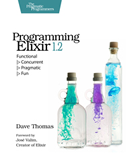

```
Roberto Nogueira  BSd EE, MSd CE
Solution Integrator Experienced - Certified by Ericsson
```

# Programming Elixir



## Table of Contents

```
Programming Elixir

Table of Contents

[x] Take the red pill
Conventional Programming
Pattern Matching
[ ] Assignment: I Do Not Think It Means What You Think It Means.
[ ] More Complex Matches
[ ] Ignoring a Value with _ (Underscore)
[ ] Variables Bind Once (per Match)
[ ] Another Way of Looking at the Equals Sign
Immutability
[ ] You Already Have (Some) Immutable Data
[ ] Immutable Data Is Known Data
[ ] Performance Implications of Immutability
[ ] Coding with Immutable Data
Elixir Basics
[ ] Built-in Types
[ ] Value Types
[ ] System Types
[ ] Collection Types
[ ] Maps
[ ] Names, Source Files, Conventions, Operators, and So On
[ ] Variable Scope
[ ] End of the Basics
Anonymous Functions
[ ] Functions and Pattern Matching
[ ] One Function, Multiple Bodies
[ ] Functions Can Return Functions
[ ] Passing Functions As Arguments
[ ] Functions Are the Core
Modules and Named Functions
[ ] Compiling a Module
[ ] The Function’s Body Is a Block
[ ] Function Calls and Pattern Matching
[ ] Guard Clauses
[ ] Default Parameters
[ ] Private Functions
[ ] The Amazing Pipe Operator: |>
[ ] Modules
[ ] Module Attributes
[ ] Module Names: Elixir, Erlang, and Atoms
[ ] Calling a Function in an Erlang Library
[ ] Finding Libraries
Lists and Recursion excerpt
[ ] Heads and Tails
[ ] Using Head and Tail to Process a List
[ ] Using Head and Tail to Build a List
[ ] Creating a Map Function
[ ] Keeping Track of Values During Recursion
[ ] More Complex List Patterns
[ ] The List Module in Action
[ ] Get Friendly with Lists
Maps, Keyword Lists, Sets, and Structs
[ ] How to Choose Between Maps and Keyword Lists
[ ] Keyword Lists
[ ] Maps
[ ] Pattern Matching and Updating Maps
[ ] Updating a Map
[ ] Structs
[ ] Nested Dictionary Structures
[ ] Sets
[ ] With Great Power Comes Great Temptation
An Aside—What Are Types?
Processing Collections—Enum and Stream
[ ] Enum—Processing Collections
[ ] Streams—Lazy Enumerables
[ ] The Collectable Protocol
[ ] Comprehensions
[ ] Moving Past Divinity
Strings and Binaries
[ ] String Literals
[ ] The Name “strings”
[ ] Single-Quoted Strings—Lists of Character Codes
[ ] Binaries
[ ] Double-Quoted Strings Are Binaries
[ ] Binaries and Pattern Matching
[ ] Familiar Yet Strange
Control Flow
[ ] if and unless
[ ] cond
[ ] case
[ ] Raising Exceptions
[ ] Designing with Exceptions
[ ] Doing More with Less
Organizing a Project
[ ] The Project: Fetch Issues from GitHub
[ ] Task: Use Mix to Create Our New Project
[ ] Transformation: Parse the Command Line
[ ] Step: Write Some Basic Tests
[ ] Transformation: Fetch from GitHub
[ ] Task: Use Libraries
[ ] Transformation: Convert Response
[ ] Transformation: Sort Data
[ ] Transformation: Take First n Items
[ ] Transformation: Format the Table
[ ] Task: Make a Command-Line Executable
[ ] Task: Add Some Logging
[ ] Task: Test the Comments
[ ] Task: Create Project Documentation
[ ] Coding by Transforming Data
Concurrent Programming
Working with Multiple Processes
[ ] A Simple Process
[ ] Process Overhead
[ ] When Processes Die
[ ] Parallel Map—The “Hello, World” of Erlang
[ ] A Fibonacci Server
[ ] Agents—A Teaser
[ ] Thinking in Processes
Nodes—The Key to Distributing Services excerpt
[ ] Naming Nodes
[ ] Naming Your Processes
[ ] I/O, PIDs, and Nodes
[ ] Nodes Are the Basis of Distribution
OTP: Servers
[ ] Some OTP Definitions
[ ] An OTP Server
[ ] GenServer Callbacks
[ ] Naming a Process
[ ] Tidying Up the Interface
OTP: Supervisors
[ ] Supervisors and Workers
[ ] Supervisors Are the Heart of Reliability
OTP: Applications
[ ] This Is Not Your Father’s Application
[ ] The Application Specification File
[ ] Turning Our Sequence Program into an OTP Application
[ ] Supervision Is the Basis of Reliability
[ ] Releasing Your Code
[ ] EXRM—the Elixir Release Manager
OTP Is Big—Unbelievably Big
[ ] Tasks and Agents
[ ] Tasks
[ ] Agents
[ ] A Bigger Example
[ ] Agents and Tasks, or GenServer?
More-Advanced Elixir
Macros and Code Evaluation
[ ] Implementing an if Statement
[ ] Macros Inject Code
[ ] Using the Representation As Code
[ ] Using Bindings to Inject Values
[ ] Macros Are Hygienic
[ ] Other Ways to Run Code Fragments
[ ] Macros and Operators
[ ] Digging Deeper
[ ] Digging Ridiculously Deep
Linking Modules: Behavio(u)rs and Use
[ ] Behaviours
[ ] Use and using
[ ] Putting It Together—Tracing Method Calls
[ ] Use use
Protocols—Polymorphic Functions
[ ] Defining a Protocol
[ ] Implementing a Protocol
[ ] The Available Types
[ ] Protocols and Structs
[ ] Build-In Protocols
[ ] Protocols Are Polymorphism
More Cool Stuff
[ ] Writing Your Own Sigils
[ ] Multi-app Umbrella Projects
[ ] But Wait! There’s More!
```
